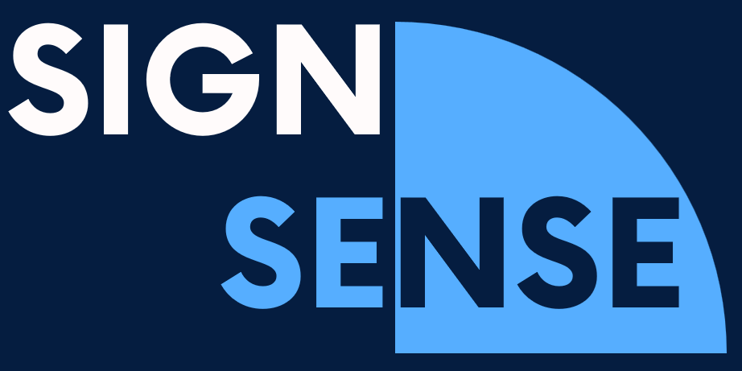

<h2>SignSense   

<h3> Sign Language Detection & Translation Web App </h3>
<strong>Developed By - </strong>
<ul>  
  <li> <a href = "https://github.com/Atharva0402">Atharva Kadam</a></li>
  <li> <a href = "https://www.linkedin.com/in/aditya-ace/">Aditya A</a></li>
  <li> Makarand Warade </li>
  
</ul>

 

## Toolset 🛠️
<i> Languages, Equipments, Environment </i>

***Related Equipments***

<ul>
  <li>Node MCU</li>
  <li>F-F Connector Cables</li>
  <li>USB Cable Connector</li>
  <li>LED Traffic Lights</li>
 
</ul>
  
   

## OverView 🔎

 
IoT based Traffic Signals, developed to be implemented in special conditions to manipulate the Traffic Lights during a Green Coridor.

 <i>
The <a href = "https://www.donatelife.org.in/green-corridor-system">Green Corridor</a> system is one way to expedite organ transplants and save lives. 
In this a special route that is managed in a way that all the traffic signals that come in the route of the hospital where an organ is harvested and the hospital where it is to be transplanted, are green and controlled manually.
 
</i>

We have created a IoT Based model to expedite the task of manipulating the Traffic Signals during such an Emergency. 

On Clicking a Button, the program will toggle the lights to Go Green and All the other lights on the intersection to Go Red.

It has been developed for  a T Intersection, but can easily be modified for any number of intersecting roads 

  

WiFi WebServer (ESP8266 WiFi Module)has been used to make it more effective for real time application. The Traffic Signals can be toggled with a single touch from a Smartphone. 

 
  
  
<footer><strong><i>Any Suggestion, Contribution and Forking is Highly Appreciated!!</i></strong></footer>

